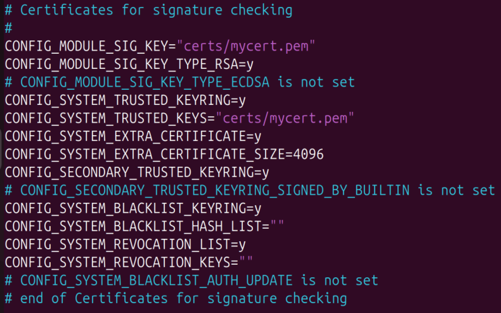
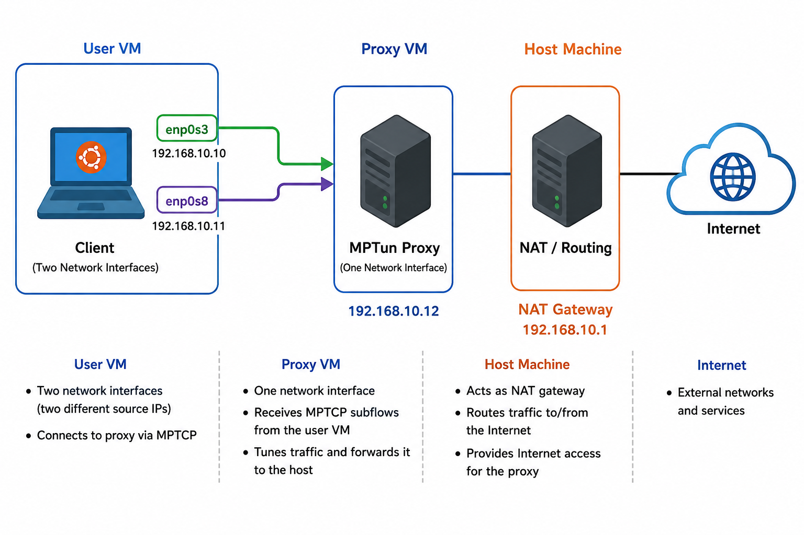

# Introduction

This document describes introductions for the NDSS Artifact Evaluation (AE) process. We provide the VMs as OVA files for the reproduction of evaluations and simple test runs. **If you use OVA files, you can skip VM setup steps (1)-(3) and proceed from (4).**

- The VM setup consists of two main steps: (1) installing Ubuntu 24.04 Desktop on VirtualBox and (2) installing the custom Linux kernel. We use Ubuntu 24.04 Desktop rather than the Server edition to make the overall evaluation process easier and more user-friendly.
- Our system uses a non-mainline Linux kernel. We began developing the system when the MPTCP eBPF scheduler was still an experimental feature and had not yet been included in the mainline Linux kernel. Since then, the MPTCP eBPF scheduler has become an official kernel feature. However, we continue to use the older custom kernel because (1) the eBPF-related structures have changed in newer kernel versions, and (2) our system has already been extensively tested and is stable with the kernel version used during development and evaluation.

# (1) Ubuntu Installation

1. Download the Ubuntu 24.04 Desktop image from:
   - https://releases.ubuntu.com/noble/

2. Create VirtualBox VM.
   - We recommend allocating at least **50 GB of storage, 3 CPU cores, and 8 GB of RAM**. These resources are mainly required for the kernel compilation process. After the kernel has been successfully compiled and installed, you can reduce the allocated resources if needed.

3. Install Ubuntu 24.04 Desktop on the VM.

# (2) Kernel Installation

Please note that we have shell scripts for the following procedure. You may want to simply run the scripts.

1. Using Git, clone the kernel repository and check out the exact version used in our artifact.

   ```bash
   git clone https://github.com/multipath-tcp/mptcp_net-next.git
   cd mptcp_net-next
   git fetch origin
   git checkout 4d907d0e9f974e706ad6f916b8bf2391d82573bf
   ```

2. Update the Ubuntu APT source configuration.

   Open the APT source file:

   ```bash
   sudo vim /etc/apt/sources.list.d/ubuntu.sources
   ```

   Replace or update the contents so that both binary packages (`deb`) and source packages (`deb-src`) are enabled, and make sure the required Ubuntu repositories are included:

   ```text
   Types: deb deb-src
   URIs: http://us.archive.ubuntu.com/ubuntu/
   Suites: noble noble-updates noble-backports noble-proposed
   Components: main restricted universe multiverse
   Signed-By: /usr/share/keyrings/ubuntu-archive-keyring.gpg

   Types: deb deb-src
   URIs: http://security.ubuntu.com/ubuntu/
   Suites: noble-security
   Components: main restricted universe multiverse
   Signed-By: /usr/share/keyrings/ubuntu-archive-keyring.gpg
   ```

   This configuration enables access to both binary and source packages from the standard Ubuntu 24.04 repositories. The source repositories are required for installing some kernel build dependencies and related development packages.

3. Run `apt update` and upgrade.

   ```bash
   sudo apt update
   sudo apt upgrade
   ```

4. Install the packages for the build environment.

   ```bash
   sudo apt-get build-dep linux linux-image-unsigned-$(uname -r)
   sudo apt-get install libncurses-dev gawk flex bison openssl        libssl-dev dkms libelf-dev libudev-dev libpci-dev libiberty-dev        autoconf
   ```

5. Copy the existing kernel configuration into the `mptcp_net-next` directory.

   ```bash
   cp /boot/config-(your current kernel version) .config
   make olddefconfig
   ```

6. Generate a self-signed certificate for kernel module signing. From the `mptcp_net-next` directory, run:

   ```bash
   openssl req -x509 -newkey rsa:4096 -keyout certs/mycert.pem -out certs/mycert.pem -nodes -days 3650
   ```

7. Update the kernel configuration to use the generated certificate.

   Open the kernel configuration file:

   ```bash
   sudo vim .config
   ```

   Find the following options:

   ```text
   CONFIG_SYSTEM_TRUSTED_KEYS
   CONFIG_MODULE_SIG_KEY
   ```

   Update them to reference the certificate generated in the previous step:

   ```text
   CONFIG_SYSTEM_TRUSTED_KEYS="certs/mycert.pem"
   CONFIG_MODULE_SIG_KEY="certs/mycert.pem"
   ```
<p align="center">
   
</p>

8. Compile and install the kernel (It takes some time....)

   ```bash
   make -j$(nproc)
   sudo make modules_install
   sudo make install
   ```

9. Configure GRUB to boot the desired kernel version.

   Open the GRUB configuration file:

   ```bash
   sudo vim /etc/default/grub
   ```

   Make the following changes:

   ```text
   GRUB_DEFAULT=saved
   GRUB_SAVEDEFAULT=true
   GRUB_TIMEOUT_STYLE=menu
   GRUB_TIMEOUT=10
   ```

   After making these changes, update the GRUB configuration:

   ```bash
   sudo update-grub
   ```

   On the next reboot, select the desired kernel from the GRUB menu. GRUB should remember this selection for subsequent boots.

# (3) TrafficSplitter Build

1. Clone our git repository.

   ```bash
   git clone https://github.com/LENSS/TrafficSplitter.git
   ```

2. Move to the `src` directory and run scripts to build BPF tools, MPTun proxy servers/clients, and MPTCP schedulers.

   ```bash
   cd TrafficSplitter/src/
   sudo chmod +x ./scripts/*.sh
   sudo ./scripts/01-install-bpf-tools.sh
   sudo ./scripts/02-generate-vmlinux-header.sh
   sudo ./scripts/03-build-schedulers.sh
   sudo ./scripts/07-build-mptun.sh
   ```

3. You can check the resulting files.

   ```bash
   ls MPTun_proxy/build/ Saflo_scheduler/build/
   ```

4. Optionally, you can remove the `bpftool` files as it is already installed.

   ```bash
   sudo rm tools/ -r
   ```

# (4) Before Starting the Evaluations

> If you are using the provided OVA files, the VM password is `ndss2027`.

## 4.1 NAT Network Setup

We assume that you have already installed VirtualBox and prepared the two VMs either by following the VM setup instructions or by importing the OVA files provided with the artifact.

Before starting the evaluation, create a VirtualBox NAT Network named `aeNet` on the **host machine**. This network enables communication between the client and proxy VMs.

The intended IP configuration is:

| Machine | Adapter | IP Address |
|---|---|---|
| User (Client) | NIC 1 | `192.168.10.10` |
| User (Client) | NIC 2 | `192.168.10.11` |
| Proxy Server | NIC 1 | `192.168.10.12` |
| NAT Gateway | — | `192.168.10.1` |
| DHCP Server | — | `192.168.10.2` |

The dynamic DHCP pool is configured as `192.168.10.100–192.168.10.254`, leaving the lower addresses available for the fixed VM addresses.

### Linux Host

Open a terminal on the host machine.

#### 1. Create and start the NAT Network

```bash
VBoxManage natnetwork add \
  --netname aeNet \
  --network "192.168.10.0/24" \
  --enable \
  --dhcp on
```

```bash
VBoxManage natnetwork start --netname aeNet
```

#### 2. Configure the DHCP server

```bash
VBoxManage dhcpserver modify \
  --network aeNet \
  --server-ip 192.168.10.2 \
  --lower-ip 192.168.10.100 \
  --upper-ip 192.168.10.254 \
  --netmask 255.255.255.0 \
  --enable
```

#### 3. Check the VM names

Before assigning the fixed IP addresses, check the names of the imported VMs:

```bash
VBoxManage list vms
```

The following commands assume that the VM names are:

- `user`
- `proxy-server`

If your VM names are different, replace them accordingly in the commands below.

#### 4. Assign fixed IP addresses

Client NIC 1:

```bash
VBoxManage dhcpserver modify \
  --network aeNet \
  --vm "user" \
  --nic 1 \
  --fixed-address 192.168.10.10
```

Client NIC 2:

```bash
VBoxManage dhcpserver modify \
  --network aeNet \
  --vm "user" \
  --nic 2 \
  --fixed-address 192.168.10.11
```

Proxy Server NIC 1:

```bash
VBoxManage dhcpserver modify \
  --network aeNet \
  --vm "proxy-server" \
  --nic 1 \
  --fixed-address 192.168.10.12
```

#### 5. Restart the DHCP server

```bash
VBoxManage dhcpserver restart --network aeNet
```

### Windows Host

Open **Command Prompt** or **PowerShell** on the host machine.

#### 1. Create and start the NAT Network

```text
VBoxManage.exe natnetwork add --netname aeNet --network "192.168.10.0/24" --enable --dhcp on
VBoxManage.exe natnetwork start --netname aeNet
```

#### 2. Configure the DHCP server

```text
VBoxManage.exe dhcpserver modify --network aeNet --server-ip 192.168.10.2 --lower-ip 192.168.10.100 --upper-ip 192.168.10.254 --netmask 255.255.255.0 --enable
```

#### 3. Check the VM names

```text
VBoxManage.exe list vms
```

The following commands assume that the VM names are `user` and `proxy-server`. If your VM names are different, replace them accordingly.

#### 4. Assign fixed IP addresses

```text
VBoxManage.exe dhcpserver modify --network aeNet --vm "user" --nic 1 --fixed-address 192.168.10.10
VBoxManage.exe dhcpserver modify --network aeNet --vm "user" --nic 2 --fixed-address 192.168.10.11
VBoxManage.exe dhcpserver modify --network aeNet --vm "proxy-server" --nic 1 --fixed-address 192.168.10.12
```

#### 5. Restart the DHCP server

```text
VBoxManage.exe dhcpserver restart --network aeNet
```

If Windows reports that `VBoxManage.exe` is not recognized, run the commands from the VirtualBox installation directory, for example:

```text
C:\Program Files\Oracle\VirtualBox
```

## 4.2 VM Network Adapter Configuration

After creating the NAT Network, configure the network adapters of the two VMs.

### User (Client)

The client VM requires **two network adapters**:

- Adapter 1: NAT Network → `aeNet`
- Adapter 2: NAT Network → `aeNet`

The expected IP addresses are:

```text
NIC 1: 192.168.10.10
NIC 2: 192.168.10.11
```

### Proxy Server

The proxy VM requires **one network adapter**:

- Adapter 1: NAT Network → `aeNet`

The expected IP address is:

```text
NIC 1: 192.168.10.12
```

## 4.3 Expected Network Topology

This configuration generates the network topology shown below.
<p align="center">
   
</p>
The client VM uses two network interfaces for MPTCP, while the proxy VM provides the remote MPTCP endpoint. Both VMs communicate through the VirtualBox `aeNet` NAT Network, and outbound traffic is forwarded through the host machine to the Internet. In the following evaluations, we establish an MPTCP tunnel between the user and the proxy, collect network traces, and conduct a scaled-down traffic-analysis evaluation.

# (5) Basic Functionality Test

# (6) Collecting Traffic Traces

# (7) Scale-down Traffic Analysis Evaluation


