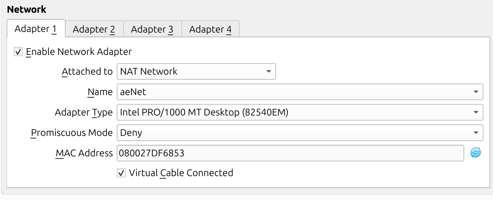
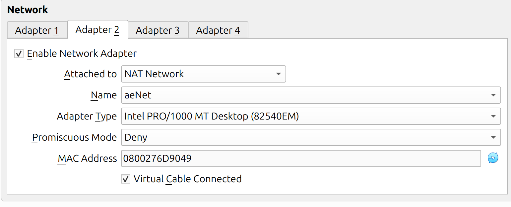
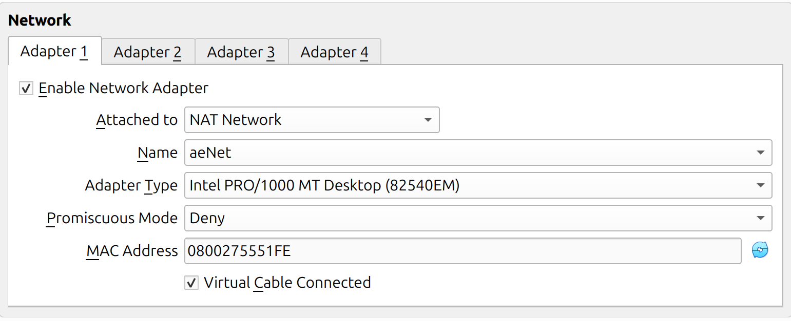
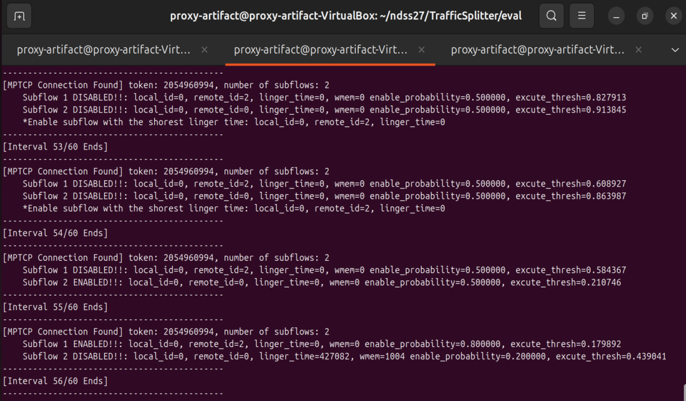
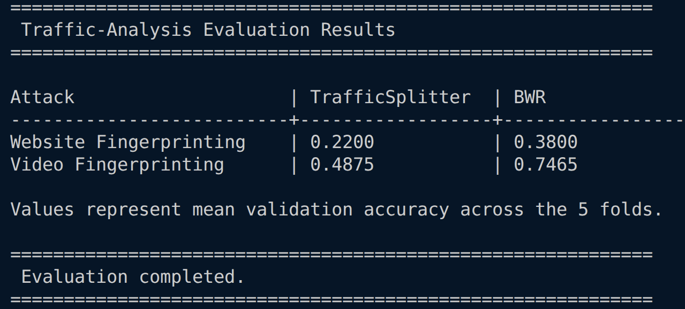

# Introduction

This document describes instructions for the NDSS Artifact Evaluation (AE) process. We provide the VMs as OVA files for the reproduction of evaluations and simple test runs. **If you use OVA files, you can skip VM setup steps (1) and proceed [from (2)](#2-before-starting-the-evaluations).**

# (1) VM Setup

This section describes how to prepare the client and proxy-server VMs for the TrafficSplitter artifact evaluation.

> If you are using the provided OVA files, you may skip this section.

- The VM setup consists of two main steps: (1) installing Ubuntu 24.04 Desktop on VirtualBox and (2) installing the custom Linux kernel. We use Ubuntu 24.04 Desktop rather than the Server edition to make the overall evaluation process easier and more user-friendly.
- Our system uses a non-mainline Linux kernel. We began developing the system when the MPTCP eBPF scheduler was still an experimental feature and had not yet been included in the mainline Linux kernel. Since then, the MPTCP eBPF scheduler has become an official kernel feature. However, we continue to use the older custom kernel because (1) the eBPF-related structures have changed in newer kernel versions, and (2) our system has already been extensively tested and is stable with the kernel version used during development and evaluation.

## 1.1 Ubuntu Installation

1. Download the Ubuntu 24.04 Desktop image from:

   - [https://releases.ubuntu.com/noble/](https://releases.ubuntu.com/noble/)

2. Create two VirtualBox VMs:
   - one for the **client**;
   - one for the **proxy server**.

   We recommend allocating at least:

   - **50 GB of storage**
   - **3 CPU cores**
   - **8 GB of RAM**

   These resources are mainly required for kernel compilation. After the kernel has been successfully compiled and installed, you may reduce the allocated resources if needed.

3. Install Ubuntu 24.04 Desktop on both VMs.

## 1.2 Custom Kernel Installation

Please note that shell scripts are provided for the following procedure. You may use the scripts instead of performing each step manually.

1. Clone the MPTCP kernel repository and check out the exact version used in our artifact.

   ```bash
   git clone https://github.com/multipath-tcp/mptcp_net-next.git
   cd mptcp_net-next
   git fetch origin
   git checkout 4d907d0e9f974e706ad6f916b8bf2391d82573bf
   ```

2. Update the Ubuntu APT source configuration.

   Open the APT source file:

   ```bash
   sudo vim /etc/apt/sources.list.d/ubuntu.sources
   ```

   Replace or update the contents so that both binary packages (`deb`) and source packages (`deb-src`) are enabled:

   ```text
   Types: deb deb-src
   URIs: http://us.archive.ubuntu.com/ubuntu/
   Suites: noble noble-updates noble-backports noble-proposed
   Components: main restricted universe multiverse
   Signed-By: /usr/share/keyrings/ubuntu-archive-keyring.gpg

   Types: deb deb-src
   URIs: http://security.ubuntu.com/ubuntu/
   Suites: noble-security
   Components: main restricted universe multiverse
   Signed-By: /usr/share/keyrings/ubuntu-archive-keyring.gpg
   ```

   This configuration enables access to both binary and source packages from the standard Ubuntu 24.04 repositories. The source repositories are required for installing some kernel build dependencies and related development packages.

3. Update and upgrade the system:

   ```bash
   sudo apt update
   sudo apt upgrade
   ```

4. Install the required kernel build dependencies:

   ```bash
   sudo apt-get build-dep linux linux-image-unsigned-$(uname -r)
   sudo apt-get install libncurses-dev gawk flex bison openssl \
       libssl-dev dkms libelf-dev libudev-dev libpci-dev libiberty-dev \
       autoconf
   ```

5. Copy the current kernel configuration into the `mptcp_net-next` directory:

   ```bash
   cp /boot/config-$(uname -r) .config
   make olddefconfig
   ```

6. Generate a self-signed certificate for kernel module signing.

   From the `mptcp_net-next` directory, run:

   ```bash
   openssl req -x509 -newkey rsa:4096 \
       -keyout certs/mycert.pem \
       -out certs/mycert.pem \
       -nodes \
       -days 3650
   ```

7. Update the kernel configuration to use the generated certificate.

   Open the kernel configuration file:

   ```bash
   sudo vim .config
   ```

   Find the following options:

   ```text
   CONFIG_SYSTEM_TRUSTED_KEYS
   CONFIG_MODULE_SIG_KEY
   ```

   Update them as follows:

   ```text
   CONFIG_SYSTEM_TRUSTED_KEYS="certs/mycert.pem"
   CONFIG_MODULE_SIG_KEY="certs/mycert.pem"
   ```
<p align="center">
   
</p>

8. Compile and install the kernel.

   > This step may take some time.

   ```bash
   make -j$(nproc)
   sudo make modules_install
   sudo make install
   ```

9. Configure GRUB to boot the desired kernel version.

   Open the GRUB configuration file:

   ```bash
   sudo vim /etc/default/grub
   ```

   Make the following changes:

   ```text
   GRUB_DEFAULT=saved
   GRUB_SAVEDEFAULT=true
   GRUB_TIMEOUT_STYLE=menu
   GRUB_TIMEOUT=10
   ```

   Then update the GRUB configuration:

   ```bash
   sudo update-grub
   ```

   Reboot the VM and select the newly installed kernel from the GRUB menu.

   GRUB should remember the selected kernel for subsequent boots.

10. After rebooting, verify the running kernel:

   ```bash
   uname -r
   ```

## 1.3 TrafficSplitter Build

1. Clone the TrafficSplitter repository:

   ```bash
   git clone https://github.com/LENSS/TrafficSplitter.git
   ```

2. Move to the `src` directory:

   ```bash
   cd TrafficSplitter/src/
   ```

3. Make the build scripts executable:

   ```bash
   chmod +x ./scripts/*.sh
   ```

4. Run the provided scripts to install the BPF tools and build the TrafficSplitter components:

   ```bash
   sudo ./scripts/01-install-bpf-tools.sh
   sudo ./scripts/02-generate-vmlinux-header.sh
   sudo ./scripts/03-build-schedulers.sh
   sudo ./scripts/04-build-mptun.sh
   ```

   These scripts build the required BPF tools, MPTCP schedulers, and MPTun client/server binaries.

5. Verify the generated files:

   ```bash
   ls MPTun_proxy/build/
   ls Saflo_scheduler/build/
   ```

6. Optionally, remove the local `bpftool` source directory after installation:

   ```bash
   sudo rm -rf tools/
   ```

After completing these steps on both VMs, proceed to the VirtualBox network configuration.

# (2) Before Starting the Evaluations
> If you are using the provided OVA files, the VM password is `ndss2027`.

Before conducting experiments, we need to configure the NAT network for the communication between VMs. This configuration generates the network topology shown below.
<p align="center">
   
</p>
The client VM uses two network interfaces for MPTCP, while the proxy VM provides the remote MPTCP endpoint. Both VMs communicate through the VirtualBox `aeNet` NAT Network, and outbound traffic is forwarded through the host machine to the Internet.

## 2.1 NAT Network Setup

We assume that you have already installed VirtualBox and prepared the two VMs either by following the VM setup instructions or by importing the OVA files provided with the artifact.

First, create a VirtualBox NAT Network named `aeNet` on the **host machine**. This network enables communication between the client and proxy VMs.

The intended IP configuration is:

| Machine | Adapter | IP Address |
|---|---|---|
| User (Client) | NIC 1 | `192.168.10.10` |
| User (Client) | NIC 2 | `192.168.10.11` |
| Proxy Server | NIC 1 | `192.168.10.12` |
| NAT Gateway | — | `192.168.10.1` |
| DHCP Server | — | `192.168.10.2` |

The dynamic DHCP pool is configured as `192.168.10.100–192.168.10.254`, leaving the lower addresses available for the fixed VM addresses.

### Linux Host

Open a terminal on the host machine.

#### 1. Create and start the NAT Network

```bash
VBoxManage natnetwork add \
  --netname aeNet \
  --network "192.168.10.0/24" \
  --enable \
  --dhcp on
```

```bash
VBoxManage natnetwork start --netname aeNet
```

#### 2. Configure the DHCP server

```bash
VBoxManage dhcpserver modify \
  --network aeNet \
  --server-ip 192.168.10.2 \
  --lower-ip 192.168.10.100 \
  --upper-ip 192.168.10.254 \
  --netmask 255.255.255.0 \
  --enable
```

#### 3. Check the VM names

Before assigning the fixed IP addresses, check the names of the imported VMs:

```bash
VBoxManage list vms
```

The following commands assume that the VM names are:

- `user`
- `proxy-server`

If your VM names are different, replace them accordingly in the commands below.

#### 4. Assign fixed IP addresses

Client NIC 1:

```bash
VBoxManage dhcpserver modify \
  --network aeNet \
  --vm "user" \
  --nic 1 \
  --fixed-address 192.168.10.10
```

Client NIC 2:

```bash
VBoxManage dhcpserver modify \
  --network aeNet \
  --vm "user" \
  --nic 2 \
  --fixed-address 192.168.10.11
```

Proxy Server NIC 1:

```bash
VBoxManage dhcpserver modify \
  --network aeNet \
  --vm "proxy-server" \
  --nic 1 \
  --fixed-address 192.168.10.12
```

#### 5. Restart the DHCP server

```bash
VBoxManage dhcpserver restart --network aeNet
```

### Windows Host

Open **Command Prompt** or **PowerShell** on the host machine.

#### 1. Create and start the NAT Network

```text
VBoxManage.exe natnetwork add --netname aeNet --network "192.168.10.0/24" --enable --dhcp on
VBoxManage.exe natnetwork start --netname aeNet
```

#### 2. Configure the DHCP server

```text
VBoxManage.exe dhcpserver modify --network aeNet --server-ip 192.168.10.2 --lower-ip 192.168.10.100 --upper-ip 192.168.10.254 --netmask 255.255.255.0 --enable
```

#### 3. Check the VM names

```text
VBoxManage.exe list vms
```

The following commands assume that the VM names are `user` and `proxy-server`. If your VM names are different, replace them accordingly.

#### 4. Assign fixed IP addresses

```text
VBoxManage.exe dhcpserver modify --network aeNet --vm "user" --nic 1 --fixed-address 192.168.10.10
VBoxManage.exe dhcpserver modify --network aeNet --vm "user" --nic 2 --fixed-address 192.168.10.11
VBoxManage.exe dhcpserver modify --network aeNet --vm "proxy-server" --nic 1 --fixed-address 192.168.10.12
```

#### 5. Restart the DHCP server

```text
VBoxManage.exe dhcpserver restart --network aeNet
```

If Windows reports that `VBoxManage.exe` is not recognized, run the commands from the VirtualBox installation directory, for example:

```text
C:\Program Files\Oracle\VirtualBox
```

## 2.2 VM Network Adapter Configuration

After creating the NAT Network, configure the network adapters of the two VMs.

### User (Client)

The client VM requires **two network adapters**:

- Adapter 1: NAT Network → `aeNet`
- Adapter 2: NAT Network → `aeNet`
<p align="center">
   
   
</p>
The expected IP addresses are:

```text
NIC 1: 192.168.10.10
NIC 2: 192.168.10.11
```

### Proxy Server

The proxy VM requires **one network adapter**:

- Adapter 1: NAT Network → `aeNet`

The expected IP address is:
<p align="center">
   
</p>

```text
NIC 1: 192.168.10.12
```

# (3) Basic Functionality Test

This test verifies that the MPTCP tunnel is established correctly, that two subflows are created, and that the Saflo scheduler operates as expected.

## 3.1 Preparation

On both the **client VM** and the **proxy server VM**, open a terminal and move to the `eval` directory of the TrafficSplitter repository:

```bash
cd ~/ndss27/TrafficSplitter/eval
```

Prepare **two terminal tabs** on each VM:

- **Tab 1:** Run the evaluation script.
- **Tab 2:** Monitor the Saflo subflow manager log.

## 3.2 Start the Proxy Server

On the **proxy server VM**, run the following command in the first terminal tab:

```bash
sudo ./01-run-func/run-trafficsplitter-server.sh
```

The script configures MPTCP, registers and selects the Saflo scheduler, starts the MPTun proxy server, and starts the Saflo subflow manager.

In the second terminal tab, monitor the subflow manager log:

```bash
tail -f 01-run-func/subflow-manager.log
```

The log shows kernel-level MPTCP subflow information and the operation of the Saflo scheduler.

## 3.3 Start the Client

On the **client VM**, run the following command in the first terminal tab:

```bash
sudo ./01-run-func/run-trafficsplitter-client.sh
```

In the second terminal tab, monitor the client-side subflow manager log:

```bash
tail -f 01-run-func/subflow-manager.log
```

After the client connects to the proxy, you should observe that the MPTCP tunnel is established with **two subflows**. The log also shows kernel-level information about the subflows and the operation of the Saflo scheduler.

<p align="center">
   
</p>

## 3.4 Observe Traffic Distribution

You can additionally inspect how traffic is distributed across the two client interfaces using Wireshark.

On the **client VM**, open another terminal tab and run:

```bash
sudo wireshark
```

In Wireshark, monitor both client network interfaces.

Then, open Firefox and generate some traffic, for example by:

- visiting several websites; or
- playing an online video.

Observe how MPTCP traffic is distributed across the two network interfaces.

## 3.5 Expected Result

A successful basic functionality test should show:

- an MPTCP tunnel established between the client and proxy;
- two active MPTCP subflows;
- Saflo scheduler activity in the subflow manager log; and
- network traffic distributed across both client interfaces.

When you are finished, press `Ctrl+C` in the terminals running `run-trafficsplitter-server.sh` and `run-trafficsplitter-client.sh` to stop the evaluation processes.

Optionally, you can run our BWR implementation with MPTun and eBPF instead of TrafficSplitter and monitor its operation using `run-bwr-server.sh` and `run-bwr-client.sh`.

> BWR does not use the Saflo subflow manager component.

# (4) Evaluation Goal

In this AE, we conduct a scaled-down traffic-analysis evaluation using two defense configurations:

- **TrafficSplitter**
- **BWR**

The purpose of this evaluation is to demonstrate the difference between the two defenses:

- TrafficSplitter is designed to provide a more comprehensive defense against both **website fingerprinting (WF)** and **video fingerprinting (VF)**, as well as other traffic-analysis attacks that fall between them.
- BWR is a traffic-splitting defense designed primarily for **website fingerprinting** and is therefore used as an attack-specific baseline (i.e., it is ineffective against VF).

We assume a **single-path eavesdropper** which can monitor one of paths between the user and tunneled-proxy. The eavesdropper is also aware of defense strategies and train its attack classifier on the traces generated under the defenses.

# (5) Collecting Traffic Traces
Before conducting the traffic-analysis evaluation, we first prepare traffic traces.

We provide **pre-collected traffic traces that are already included in our git repository**. So, if your goal is to evaluate the reproducibility of our work or just simply test traffic analysis evaluation, you may skip this section and proceed directly to the [scaled-down traffic-analysis evaluation](#6-scaled-down-traffic-analysis-evaluation). You just need to unzip the pre-collected traces included in our git repository.
```bash
sudo apt install unzip
cd ~/ndss27/TrafficSplitter/eval/02-data-collection
unzip "*.zip"
```
If you would like to collect traffic traces yourself or extend the provided dataset, you can follow the procedure below. We assume an eavesdropper monitoring the first network interface of the client VM; therefore, traffic is collected from this interface. The client generates traffic by visiting websites or playing YouTube videos in Google Chrome while `tcpdump` records the traffic.


## 5.1 Start the Defense Configuration

On both VMs, move to the evaluation directory:

```bash
cd ~/ndss27/TrafficSplitter/eval
```

As in Section (3), start the **server first**, followed by the **client**.

### TrafficSplitter

On the proxy server VM:

```bash
sudo ./01-run-func/run-trafficsplitter-server.sh
```

On the client VM:

```bash
sudo ./01-run-func/run-trafficsplitter-client.sh
```

### BWR

On the proxy server VM:

```bash
sudo ./01-run-func/run-bwr-server.sh
```

On the client VM:

```bash
sudo ./01-run-func/run-bwr-client.sh
```

> BWR does not use the Saflo subflow manager component.

## 5.2 Collect Website Traces

Open a new terminal tab on the **client VM** and run:

```bash
./02-data/collection/web-collecting.sh <trace-name>
```

For example, when collecting traces with TrafficSplitter:

```bash
./02-data/collection/web-collecting.sh trafficsplitter
```

For BWR:

```bash
./02-data/collection/web-collecting.sh bwr
```

## 5.3 Collect Video Traces

Similarly, collect video traces on the **client VM** using:

```bash
./02-data/collection/video-collecting.sh <trace-name>
```

For example, when collecting traces with TrafficSplitter:

```bash
./02-data/collection/video-collecting.sh trafficsplitter
```

For BWR:

```bash
./02-data/collection/video-collecting.sh bwr
```

## 5.4 Run Website and Video Collection Sequentially

You may also run the website and video collection scripts sequentially.

For TrafficSplitter:

```bash
./02-data/collection/web-collecting.sh trafficsplitter && \
./02-data/collection/video-collecting.sh trafficsplitter
```

For BWR:

```bash
./02-data/collection/web-collecting.sh bwr && \
./02-data/collection/video-collecting.sh bwr
```

The second collection script starts only after the first one completes successfully.

# (6) Scaled-Down Traffic-Analysis Evaluation

This evaluation is conducted on the **client VM**, where the traffic traces are available.

## 6.1 Prerequisites

First, make sure the Python virtual environment is configured properly. If you imported the provided OVA files, it is already configured and you can skip this step. Otherwise, please create and activate a Python virtual environment:

```bash
sudo apt install -y python3-venv python3-full

cd ~/ndss27/TrafficSplitter/eval/03-traffic-analysis

python3 -m venv .venv
source .venv/bin/activate

python -m pip install --upgrade pip
python -m pip install tensorflow pandas matplotlib
```
`matplotlib` is optional and is only needed for plotting traces.

Also, please make sure that the traffic traces are located in the following directory:

```text
TrafficSplitter/eval/02-data-collection/bwr-video-traces/
TrafficSplitter/eval/02-data-collection/bwr-web-traces/
TrafficSplitter/eval/02-data-collection/trafficsplitter-video-traces/
TrafficSplitter/eval/02-data-collection/trafficsplitter-web-traces/
```

## 6.2 Run the Evaluation

Move to the traffic-analysis evaluation directory:

```bash
cd ~/ndss2027/TrafficSplitter/eval/03-traffic-analysis
```

Then run:

```bash
./run-traffic-analysis.sh
```

The script automatically:

1. preprocesses the TrafficSplitter and BWR website traces;
2. preprocesses the TrafficSplitter and BWR video traces;
3. trains and evaluates the website-fingerprinting classifier;
4. trains and evaluates the video-fingerprinting classifier; and
5. prints a summary table in the terminal.

Please note that, because this AE uses a substantially smaller dataset than the full evaluation in the paper, we use **lighter versions of the WF and VF classifiers** to reduce training time and computational requirements on the VM.

At the end of the evaluation, you should see a summary similar to:

```text
============================================================
 Traffic-Analysis Evaluation Results
============================================================

Attack                    | TrafficSplitter  | BWR
--------------------------+------------------+-----------------
Website Fingerprinting    | ...              | ...
Video Fingerprinting      | ...              | ...

Values represent mean validation accuracy across the 5 folds.
```

## 6.3 Clear Evaluation Results

After the evaluation, you can remove all generated TFRecords, trained models, and evaluation logs by running:

```bash
./run-traffic-analysis.sh --clear
```

This command does **not** remove the original collected traffic traces.

## 6.4 Result Interpretation

The exact accuracy values may differ from the full-scale results reported in the paper because this AE uses a much smaller dataset and lighter attack classifiers. However, the scaled-down evaluation is intended to reproduce the **main behavioral difference** between BWR and TrafficSplitter.

TrafficSplitter is designed to provide broader protection against multiple traffic-analysis attacks. Therefore, it should remain effective against both **website fingerprinting (WF)** and **video fingerprinting (VF)**.

In contrast, BWR is primarily designed as a website-fingerprinting defense. Its effectiveness is therefore expected to degrade more noticeably under the VF attack.

The purpose of this scaled-down experiment is not to reproduce the exact numerical results from the paper, but to demonstrate the paper's key observation: **TrafficSplitter provides more comprehensive protection against different types of traffic-analysis attacks, whereas existing traffic-splitting defenses such as BWR are more attack-specific.**

<p align="center">
   
</p>
